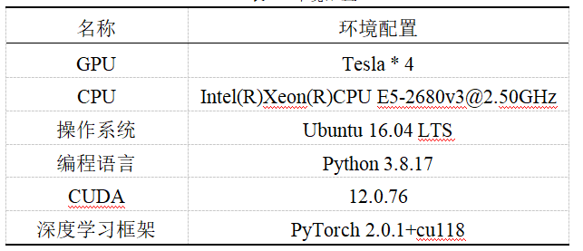
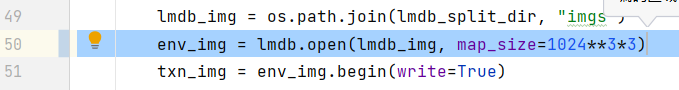

# 2024年泰迪杯B题代码使用简易教程（参考Chinese-CLIP的README.md文件）
## 安装要求
开始本项目前，需先检查是否满足下列环境配置要求:

* python >= 3.6.4
* pytorch >= 1.8.0 (with torchvision >= 0.9.0)
* CUDA Version >= 10.2
* 上面是项目的推荐环境要求，下面的是比赛使用的环境
* 

运行下列命令即可安装本项目所需的三方库。

```bash
pip install -r requirements.txt -i https://pypi.tuna.tsinghua.edu.cn/simple
```


## 数据准备

### 放置数据

#### 1.将附件1中的ImageData中的图片复制到Chinese-CLIP/ImageData_original文件夹下,ImageWordData.csv文件复制到Chinese-CLIP/data_txt文件夹下


#### 2.将附件2中的ImageData中的图片复制到Chinese-CLIP/ImageData_text_img文件夹下,word_test.csv文件复制到Chinese-CLIP/data_csv文件夹下


#### 3.将附件3中的ImageData中的图片复制到Chinese-CLIP/ImageData_img_text文件夹下,word_data.csv文件复制到Chinese-CLIP/data_csv文件夹下


#### 4.预训练模型放置在Chinese-CLIP/下面。


#### 5.结果模型放置在Chinese-CLIP/model_wight下面。

### 处理数据

#### 为了与Chinese-CLIP代码适配，同时保证数据处理和读取的效率，我们建议将训练&评测使用的图文数据集统一处理成如下的方式：

```
${DATAPATH}
└── datasets/
    └── ${dataset_name}/
        ├── train_imgs.tsv      # 图片id & 图片内容
        ├── train_texts.jsonl   # 文本id & 文本内容，连同匹配的图片id列表
        ├── valid_imgs.tsv
        ├── valid_texts.jsonl
        ├── test_imgs.tsv
        └── test_texts.jsonl
```
#### 1.运行下面命令处理训练集数据。

```bash
python data_process.py
```

#### 2.通过修改data_processing_test.py中的代码（**注释**）处理**文搜图和图搜文**数据，之后运行下面命令处理数据。

```bash
python data_process_test.py
```
#### 3.结果是在dataset文件夹中得到三个数据集。

#### 4.我们还需要将tsv和jsonl文件一起序列化，转换为内存索引的LMDB数据库文件，方便训练时的随机读取.

#### 5.如下图，cn_clip/preprocess/build_lmdb_dataset.py中50行代码出可以根据数据集大小修改LMDB的默认大小。现在是3G。



#### 6.依次运行下面命令处理数据。建议处理完*训练数据*，减小LMDB数据库大小。

```bash
python cn_clip/preprocess/build_lmdb_dataset.py \
    --data_dir datasets/tiandijinghua
    --splits train,valid,test
```

```bash
python cn_clip/preprocess/build_lmdb_dataset.py \
    --data_dir datasets/res1
    --splits test
```

```bash
python cn_clip/preprocess/build_lmdb_dataset.py \
    --data_dir datasets/res2
    --splits test
```

例如对于MUGE数据集，则`${dataset_name}`设为MUGE，`--splits`指定需要转换的数据集划分，以逗号不加空格分隔。转换后，数据集文件夹下会对应增加以下LMDB序列化文件
```
${DATAPATH}
└── datasets/
    └── ${dataset_name}/
        └── lmdb/
            ├── train
            │   ├── imgs
            │   └── pairs
            ├── valid
            └── test
```


## 模型训练

#### 1.根据需求修改run_scripts/tiandijinghua.sh中的参数，使用clip_cn_vit-l-14-336.pt预训练模型进行finetune.

```bash
cd Chinese-CLIP/
bash run_scripts/tiandijinghua.sh
```

相关的训练配置项包括:

+ 分布式
  + `WORKER_CNT`: 训练的机器个数
  + `GPUS_PER_NODE`: 每个机器上的GPU个数
+ 训练/验证数据
  + `train-data`: 训练数据LMDB目录，准备LMDB数据文件的预处理流程见上。
  + `val-data`: 验证数据LMDB目录，指定为None时，则不进行训练过程中的验证。
  + `num-workers`: 训练集数据处理（DataLoader）的进程数，默认为4。
  + `valid-num-workers`: 验证集数据处理（DataLoader）的进程数（如果进行验证），默认为1。
+ 训练超参数
  + `vision-model`: 指定视觉backbone, 从 `["ViT-B-16", "ViT-L-14", "ViT-L-14-336", "ViT-H-14", "RN50"]`选择。
  + `text-model`: 指定文本backbone, 从 `["RoBERTa-wwm-ext-base-chinese", "RoBERTa-wwm-ext-large-chinese", "RBT3-chinese"]`选择。
  + `context-length`: 文本输入序列长度。
  + `warmup`: warmup步数。
  + `batch-size`: 训练时单卡batch-size。（请保证`训练样本总数 > batch-size * GPU数`，至少满足1个训练batch）
  + `lr`: 学习率。
  + `wd`: weight decay。
  + `max-steps`: 训练步数，也可通过`max-epochs`指定训练轮数。
  + `freeze-vision`: 是否freeze视觉backbone。
  + `use-augment`: 是否使用[AutoAugment](https://arxiv.org/abs/1805.09501)对图片进行数据增强。
  + `valid-batch-size`: 验证时单机batch-size。（请保证`验证集样本总数 > batch-size * GPU数`，至少满足1个验证batch）
  + `valid-step-interval`和`valid-epoch-interval`: 验证step/epoch频率，指定为-1时则在训练中不进行验证。
  + `grad-checkpointing`: <span id="checkpointing"></span>使用[重计算策略](https://pytorch.org/docs/stable/checkpoint.html)，在前向过程中不保存中间结果，以训练时间换取更小的显存开销，适用于显存不足的情况。（`store_true`参数，直接在脚本中加上`--grad-checkpointing`即可，目前要求Pytorch>1.8.0）
  + `mask-ratio`: <span id="FLIP"></span>参照[FLIP](https://arxiv.org/abs/2212.00794)的策略，在finetune时可指定随机mask一定比例的图像patch，以降低显存开销、加快训练速度。默认为0.0，即不激活这一策略。
  + `use-flash-attention`: 使用[FlashAttention](https://arxiv.org/abs/2205.14135)，可在不影响效果的条件下为Chinese-CLIP的finetune过程显著提速以及降低显存占用。（`store_true`参数，配置好环境后，在脚本中加上`--use-flash-attention`即可，请详见[flash_attention.md](flash_attention.md)）
  + `accum-freq`: <span id="gradient_accumulation"></span>梯度累积频率，默认为1。指定为大于1的整数时开启对比学习梯度累积，模拟更大的batch size。如果单卡batch size为`m`，则总的batch size为`accum_freq * m * GPU数`。
  + `gather-with-grad`: 是否在分布式训练时进行带有完整梯度的特征gather，默认关闭。
+ 输出选项
  + `name`: 指定输出路径。超参日志, 训练日志以及产出ckpt均会存放至 `${DATAPATH}/experiments/${name}/`。
  + `save-step-frequency`及`save-epoch-frequency`: 存ckpt的步数或轮数间隔。
  + `report-training-batch-acc`: 日志是否报告训练图到文&文到图batch准确率。
+ 权重读取相关选项
  + `resume`: 权重读取的路径。示例脚本中指定为预训练ckpt路径，也可以指定为用户自己finetune的ckpt路径做继续训练。
  + `reset-data-offset`: 是否从此前的数据断点续跑。如batch size或GPU卡数超参改变，建议打开此选项。
  + `reset-optimizer`: 是否使用optimizer state。

训练完毕，log 会自动存在`${DATAPATH}/experiments/${name}/out_${timestamp}.log`，训练log格式如下所示:
```
2022-12-11,20:40:34 | INFO | Rank 0 | Global Steps: 1/735 | Train Epoch: 1 [1024/250880 (0%)] | Loss: 2.371020 | Image2Text Acc: 49.90 | Text2Image Acc: 48.73 | Data Time: 1.039s | Batch Time: 3.625s | LR: 0.000000 | logit_scale: 4.605 | Global Batch Size: 1024
```
验证log格式如下所示:
```
2022-12-11,20:42:47 | INFO | Rank 0 | Validation Result (epoch 1 @ 150 steps) | Valid Loss: 0.502810 | Image2Text Acc: 84.95 | Text2Image Acc: 84.26 | logit_scale: 4.605 | Valid Batch Size: 128
```


## 预测

### 图文特征提取


### 项目提供的。
```bash
cd Chinese-CLIP/
export CUDA_VISIBLE_DEVICES=0
export PYTHONPATH=${PYTHONPATH}:`pwd`/cn_clip

split=valid # 指定计算valid或test集特征
resume=${DATAPATH}/pretrained_weights/clip_cn_vit-b-16.pt

python -u cn_clip/eval/extract_features.py \
    --extract-image-feats \
    --extract-text-feats \
    --image-data="${DATAPATH}/datasets/${datasets}/lmdb/${split}/imgs" \
    --text-data="${DATAPATH}/datasets/${datasets}/${split}_texts.jsonl" \
    --img-batch-size=32 \
    --text-batch-size=32 \
    --context-length=52 \
    --resume=${resume} \
    --vision-model=ViT-B-16 \
    --text-model=RoBERTa-wwm-ext-base-chinese
```

产出图文特征默认将保存于`${DATAPATH}/datasets/${dataset_name}`目录下，图片特征保存于`${split}_imgs.img_feat.jsonl`文件，每行以json存储一张图片的特征，格式如下：
```
{"image_id": 1000002, "feature": [0.0198, ..., -0.017, 0.0248]}
```
文本特征则保存于`${split}_texts.txt_feat.jsonl`，格式如下：
```
{"text_id": 248816, "feature": [0.1314, ..., 0.0018, -0.0002]}
```


### 适合比赛的（根据环境修改img-batch-size),替换resume中的模型得到不同结果。

### 1.处理附件2的数据。

```bash
cd Chinese-CLIP/
export CUDA_VISIBLE_DEVICES=0
export PYTHONPATH=${PYTHONPATH}:`pwd`/cn_clip

python -u cn_clip/eval/extract_features.py \
    --extract-image-feats \
    --extract-text-feats \
    --image-data="../../datasets/res1/lmdb/test/imgs" \
    --text-data="../../datasets/res1/test_texts.jsonl" \
    --img-batch-size=64 \
    --text-batch-size=1024 \
    --context-length=52 \
    --resume="../../model_weight/336_416_1.pt" \
    --vision-model=ViT-L-14-336 \
    --text-model=RoBERTa-wwm-ext-base-chinese 
```
### 2.处理附件3的数据。

```bash
cd Chinese-CLIP/
export CUDA_VISIBLE_DEVICES=0
export PYTHONPATH=${PYTHONPATH}:`pwd`/cn_clip

python -u cn_clip/eval/extract_features.py \
    --extract-image-feats \
    --extract-text-feats \
    --image-data="../../datasets/res2/lmdb/test/imgs" \
    --text-data="../../datasets/res2/test_texts.jsonl" \
    --img-batch-size=64 \
    --text-batch-size=1024 \
    --context-length=52 \
    --resume="../../model_weight/336_416_1.pt" \
    --vision-model=ViT-L-14-336 \
    --text-model=RoBERTa-wwm-ext-base-chinese 
```


### KNN检索，计算文到图、图到文检索的top-k召回结果。

### 项目提供的。
```bash
cd Chinese-CLIP/
split=valid # 指定计算valid或test集特征
python -u cn_clip/eval/make_topk_predictions.py \
    --image-feats="${DATAPATH}/datasets/${datasets}/${split}_imgs.img_feat.jsonl" \
    --text-feats="${DATAPATH}/datasets/${datasets}/${split}_texts.txt_feat.jsonl" \
    --top-k=10 \
    --eval-batch-size=32768 \
    --output="${DATAPATH}/datasets/${datasets}/${split}_predictions.jsonl"
```
产出的结果保存在指定的jsonl文件中，每行表示一个文本召回的top-k图片id，格式如下：
```json
{"text_id": 153915, "image_ids": [5791244, 1009692167, 7454547004, 3564007203, 38130571, 2525270674, 2195419145, 2503091968, 4966265765, 3690431163]}
```
对于图到文检索（图片召回相关文本），类似地，请运行以下命令：
```bash
split=valid # 指定计算valid或test集特征
python -u cn_clip/eval/make_topk_predictions_tr.py \
    --image-feats="${DATAPATH}/datasets/${datasets}/${split}_imgs.img_feat.jsonl" \
    --text-feats="${DATAPATH}/datasets/${datasets}/${split}_texts.txt_feat.jsonl" \
    --top-k=10 \
    --eval-batch-size=32768 \
    --output="${DATAPATH}/datasets/${datasets}/${split}_tr_predictions.jsonl"
```
产出结果每行表示一个图片召回的top-k文本id，格式如下：
```json
{"image_id": 977856234, "text_ids": [156914, 157914, 158914, 155914, 156179, 158907, 157179, 154179, 154914, 154723]}
```


### 适合比赛的，使用不同模型得到的特征，得到不同预测结果。

#### 1.对于文到图检索，请运行以下命令：
```bash
cd Chinese-CLIP/
python -u cn_clip/eval/make_topk_predictions.py \
    --image-feats="../../datasets/res1/test_imgs.img_feat.jsonl" \
    --text-feats="../../datasets/res1/test_texts.txt_feat.jsonl" \
    --top-k=10 \
    --eval-batch-size=32768 \
    --output="../../datasets/res1/test_predictions.jsonl"
```

#### 2.对于图到文检索，请运行以下命令：
```bash
cd Chinese-CLIP/
python -u cn_clip/eval/make_topk_predictions_tr.py \
    --image-feats="../../datasets/res2/test_imgs.img_feat.jsonl" \
    --text-feats="../../datasets/res2/test_texts.txt_feat.jsonl" \
    --top-k=10 \
    --eval-batch-size=32768 \
    --output="../../datasets/res2/test_predictions_tr.jsonl"
```


## 模型融合

### 依次运行result.ipynb中的代码，完成对文搜图和图搜文的结果融合。取二十个结果中的前五个。


## 得到结果

### 依次运行result.ipynb中之后的代码，使用原始id替换重命名的id，完成结果文件的输出，


# 致谢+引用

## 特别感谢该项目的作者和贡献者，他们的工作对我们本次比赛的完成起到了重要的支持和帮助：

```
@article{chinese-clip,
  title={Chinese CLIP: Contrastive Vision-Language Pretraining in Chinese},
  author={Yang, An and Pan, Junshu and Lin, Junyang and Men, Rui and Zhang, Yichang and Zhou, Jingren and Zhou, Chang},
  journal={arXiv preprint arXiv:2211.01335},
  year={2022}
}
```
## 我们非常感激这个开源项目，为我们提供了宝贵的资源和灵感，让我们的比赛得以顺利进行和完善。非常感谢！！


